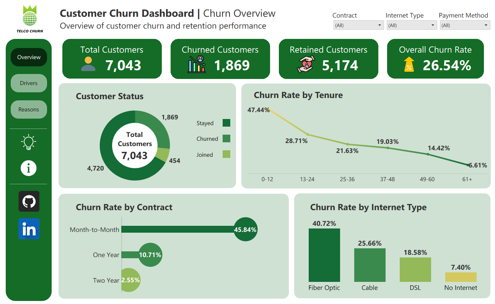
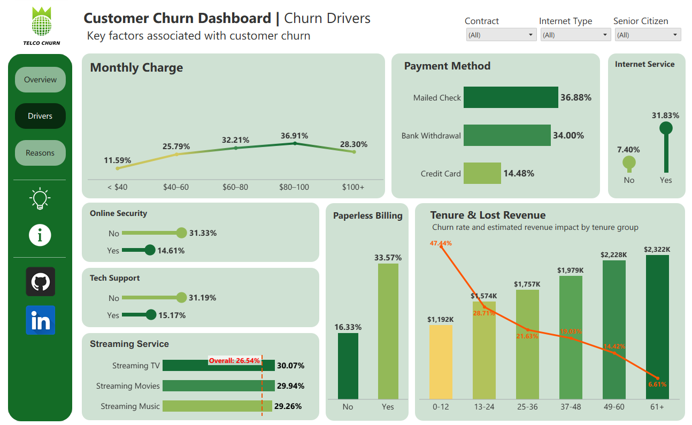
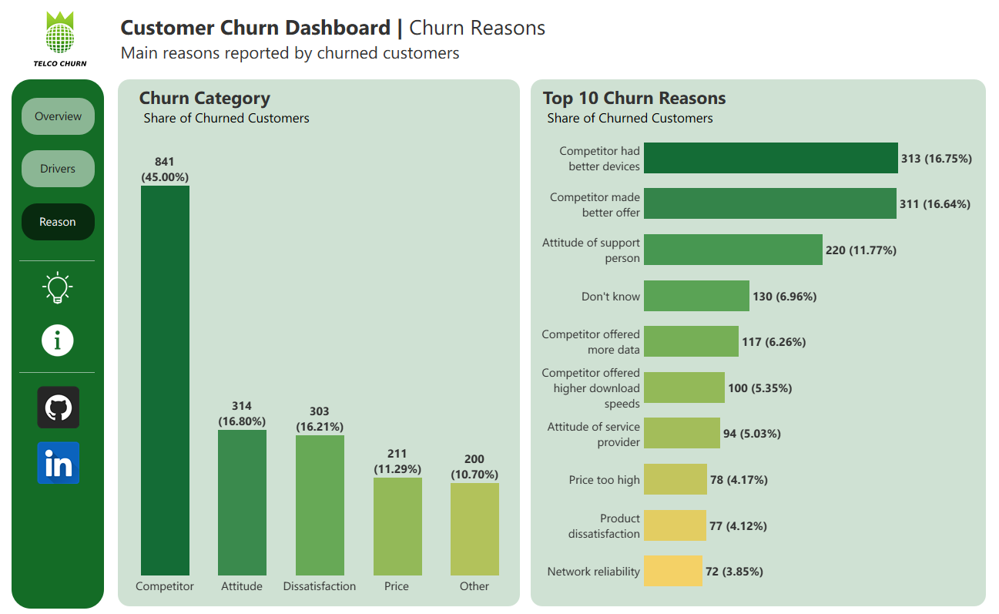
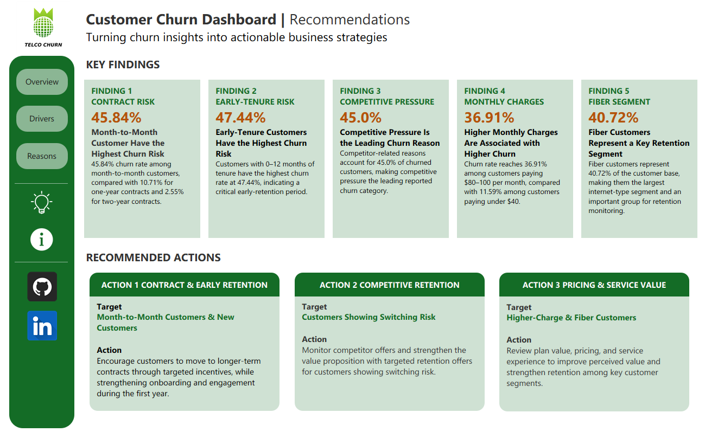
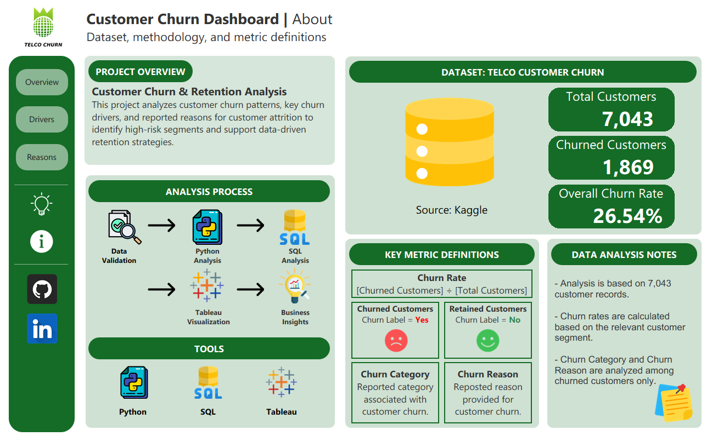

# Customer Churn & Retention Analysis

## 📌 Overview

This project analyzes customer churn and retention patterns to identify high-risk customer segments and generate data-driven retention insights.

**Dataset:** 7,043 customers
**Churned:** 1,869
**Churn Rate:** 26.54%

---

## 📊 Dashboard Preview

### Overview



### Other Dashboard Pages

<table>
  <tr>
    <td align="center">
      
      <br/>
      <b>Churn Drivers</b>
    </td>
    <td align="center">
      
      <br/>
      <b>Churn Reasons</b>
    </td>
  </tr>
  <tr>
    <td align="center">
      
      <br/>
      <b>Recommendations</b>
    </td>
    <td align="center">
      
      <br/>
      <b>About</b>
    </td>
  </tr>
</table>


---

## 📂 Dataset

* **Source:** [Kaggle — Telco Customer Churn Dataset](https://www.kaggle.com/datasets/alfathterry/telco-customer-churn-11-1-3)
* **Author:** alfathterry

The dataset contains customer demographic, service, billing, contract, and churn information.

---

## 🔄 Analysis Workflow

```text
Raw Data
   ↓
Python — Data Validation & Analysis
   ↓
SQL — Analysis & Verification
   ↓
Tableau — Interactive Dashboard
   ↓
Business Insights
```

---

## 🔍 Key Insights

* **Month-to-Month** customers have the highest churn rate at **45.84%**.
* Customers with **0–12 months tenure** have the highest churn rate at **47.44%**.
* **Fiber Optic** customers have a churn rate of **40.72%**.
* The **$80–100** monthly charge group has the highest churn rate at **36.91%**.
* **Competitor** is the largest reported churn category with **841 customers**.

---

## 🛠️ Tools & Technologies

**Python** · **Pandas** · **MySQL** · **Tableau**

---

## 📁 Project Structure

```text
Customer_Churn_Retention_Analysis/
│
├── data/
│   └── telco.csv
│
├── python/
│   └── customer_churn_analysis.ipynb
│
├── sql/
│   ├── 01_data_validation.sql
│   └── 02_churn_analysis.sql
│
├── tableau/
│   └── customer_churn.twbx
│
├── dashboard/
│   ├── churn_overview.png
│   ├── churn_drivers.png
│   ├── churn_reasons.png
│   ├── recommendations.png
│   └── about.png
│
└── insights/
    └── customer_churn_insights.md
```

---

## 📄 Business Insights

Detailed findings and business interpretation are available in:

`insights/customer_churn_insights.md`

---

## ⚠️ Note

Findings represent observed patterns and associations in the dataset and do not establish direct causal relationships.

---

## 👤 Author

**Chanakan Angyan**

Bachelor of Science in Computer Science

**Skills:** Python | SQL | Tableau

**GitHub:** https://github.com/Chanakan-Angyan

**LinkedIn:** [linkedin.com/in/chanakan-angyan](https://www.linkedin.com/in/chanakan-angyan-a2596742a/)